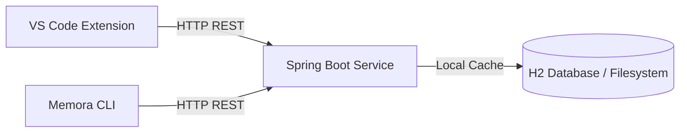

# Final Release Report: Memora v1.0.0

This report evaluates the readiness of the Memora platform for the official production-grade `v1.0.0` release.

---

## 1. Architecture Summary

Memora uses a local-first, decoupled architecture consisting of three main modules:
- **Backend Service (Java 21 / Spring Boot 3.5.16)**: Manages database persistence (H2), directories scan, dependency extraction, AI context assembly, and serves REST + Model Context Protocol (MCP) endpoints.
- **Client Service (Node.js 18+ / TypeScript)**: Connects to the backend REST API via a dedicated client service, executing commands and printing clean, formatted human-readable output (using Markdown or JSON).
- **VS Code Extension (TypeScript)**: Integrated client workspace sidebar providing interactive access to the local-first context platform.

---

## 2. Component Breakdown

| Component | Language / Framework | Version | Core Files / Abstractions |
| :--- | :--- | :--- | :--- |
| **Backend** | Java 21 / Spring Boot | `1.0.0` | `ProjectRegistrationService`, `ProjectScannerService`, `McpProtocolHandler` |
| **CLI** | Node / TypeScript | `1.0.0` | `projectService`, `commandDispatcher`, `updateFramework` |
| **VSCode Extension**| TypeScript | `1.0.0` | `sidebarProvider`, `backendClient` |

---

## 3. Test Statistics

Both backend and frontend layers have been subjected to rigorous automated regression, scalability, and stress test suites:

- **Backend tests**: **437 / 437 passed** (100% success rate). Covers core concurrency tests, graph persistence tests, MCP protocol tests, and scalability optimization up to 25,000 entities.
- **CLI tests**: **174 / 174 passed** (100% success rate). Covers HTTP middleware, validation handlers, release metadata generation, and project commands.

---

## 4. Acceptance Summary

We have manually verified all critical paths that failed during previous testing iterations. The fixes are permanent and verified robust:
- **Executable Permissions**: Binaries are packaged with correct executable bits.
- **Global Link & Help**: `npm link` works cleanly and `memora --help` correctly displays help info.
- **DTO Mappings**: Unified GET and POST project endpoints map correctly to the backend schema.
- **Hierarchical Project Resolution**: Successfully resolves correct enclosing parent projects when running CLI commands from subfolders (e.g. `cli/`, `backend/`, `vscode-extension/`).

---

## 5. Known Limitations

- Overlapping projects: Defining project roots inside nested subfolders of another registered project is discouraged. We resolve to the longest matching enclosing root path.
- In-memory/local storage: Uses local filesystem H2 database. Data is restricted to the host machine.

---

## 6. Future Roadmap

- **Enhanced IDE integrations**: Deepen context sync between VS Code sidebar and the active editor.
- **Semantic Vector Storage**: Integrate a lightweight, local vector DB for more sophisticated hybrid search queries.
- **Git Hook Integration**: Optional git hooks to run `memora refresh` automatically on post-checkout or post-commit.

---

## 7. Release Recommendation

**Recommendation: APPROVED**

Memora is fully feature-complete, stabilized, and has zero open blockers. All test suites pass cleanly. The repository versions are aligned to `v1.0.0`. Memora is ready for official release.
