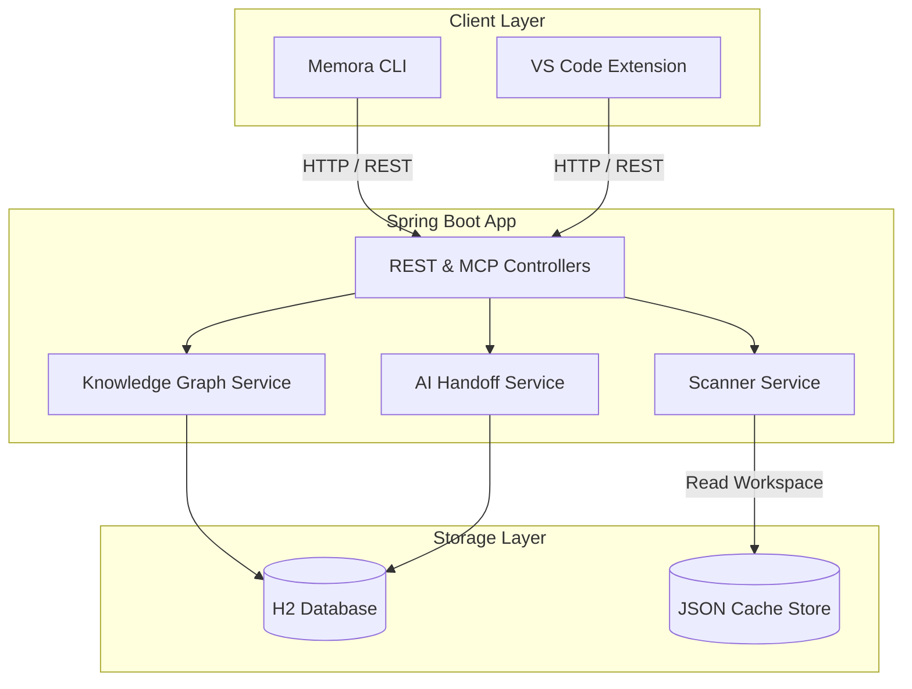

# Memora — Local-First AI Context Platform

Memora is a local-first AI Context Platform designed to orchestrate, analyze, index, and retrieve project-level knowledge, developer decisions, features, tasks, and system constraints. It acts as the ultimate semantic bridge between local development environments, command-line interfaces, IDE extensions, and Large Language Models.

---

## Architecture Diagram



---

## Features

- **Semantic Project Scanning**: Automated structural codebase scans discovering dependencies, symbol relationships, and structural hashes.
- **Hierarchical Project Resolution**: Automatic workspace matching mapping nested modules to the closest parent project root.
- **AI Handoff Generation**: Automated summarization of the current active codebase state (including modified files, features, tasks, and assumptions) for LLM context injection.
- **Unified Knowledge Search**: Cross-project and cross-context vector-like search utilizing relational graphs.
- **First-Class MCP Integration**: Fully compliant Model Context Protocol server exposing project resources, prompts, and tools to AI clients.
- **Security Isolation**: Path boundary controls ensuring files are scanned only within designated workspace roots.

---

## Requirements

- **Java**: JDK 21+
- **Node.js**: Node 18+ (LTS recommended)
- **Maven**: Included via `./mvnw` wrapper

---

## Quick Setup

For detailed instructions, refer to [INSTALL.md](file:///Users/chanchalkumar/Documents/Codex/2026-07-12/we-are-starting-the-implementation-of/INSTALL.md) and [QUICKSTART.md](file:///Users/chanchalkumar/Documents/Codex/2026-07-12/we-are-starting-the-implementation-of/QUICKSTART.md).

### 1. Build and Run the Backend
```bash
cd backend
./mvnw clean package
./mvnw spring-boot:run
```
The server will start at `http://localhost:8080`.

### 2. Build and Install the CLI
```bash
cd cli
npm install
npm run build
npm link
```
Verify the installation by running:
```bash
memora --version
```

---

## Example CLI Commands

```bash
# Register a project root
memora init

# Run a project indexing scan
memora refresh

# Generate a context handoff markdown for LLM injection
memora handoff --stdout

# Search the semantic knowledge graph
memora search "database migration"

# Unregister a project
memora unregister
```

---

## Project Structure

- [backend/](file:///Users/chanchalkumar/Documents/Codex/2026-07-12/we-are-starting-the-implementation-of/backend) — Spring Boot backend engine.
- [cli/](file:///Users/chanchalkumar/Documents/Codex/2026-07-12/we-are-starting-the-implementation-of/cli) — TypeScript command-line interface.
- [vscode-extension/](file:///Users/chanchalkumar/Documents/Codex/2026-07-12/we-are-starting-the-implementation-of/vscode-extension) — VS Code workspace helper extension.
- [docs/](file:///Users/chanchalkumar/Documents/Codex/2026-07-12/we-are-starting-the-implementation-of/docs) — Architecture and developer guides.

---

## Development Workflow

### Building
- **Backend**: `./mvnw clean compile`
- **CLI**: `npm run build` inside `cli/`

### Testing
- **Backend Tests**: `./mvnw test`
- **CLI Tests**: `npm run test` inside `cli/`

---

## Contributing

We welcome contributions! Please make sure all PRs pass:
1. All Maven unit/integration tests
2. All Jest CLI tests
3. ESLint and TypeScript compilation checks

---

## License

This project is licensed under the MIT License. See [LICENSE](file:///Users/chanchalkumar/Documents/Codex/2026-07-12/we-are-starting-the-implementation-of/vscode-extension/LICENSE) for details.