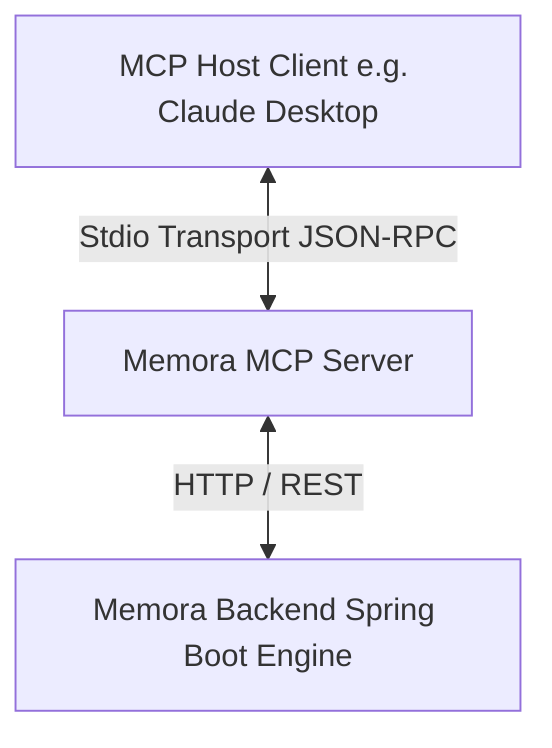

# Memora Model Context Protocol (MCP) Server

This is the standalone Model Context Protocol (MCP) server for the Memora local-first AI context engine. It allows MCP client hosts (such as Claude Desktop, Cursor, or VS Code) to query and interact with project contexts, features, tasks, and constraints.

---

## Purpose

The Memora MCP Server exposes the local-first context platform's abilities as formal MCP resources, prompts, and tools, allowing LLM assistants to dynamically query codebase structures, create/update active development logs, and run semantic queries over registered project knowledge graphs.

---

## Architecture

This module implements a Node.js-based TypeScript MCP Server using the official `@modelcontextprotocol/sdk`.



---

## Startup & Development

### 1. Requirements
- Node.js (>=18.0.0)
- npm

### 2. Setup
Install all dependencies:
```bash
npm install
```

### 3. Build & Run
To compile the TypeScript project:
```bash
npm run build
```

To run the MCP server on stdio transport:
```bash
npm run start
```

### 4. Configuration
You can customize the server behavior using the following environment variables:
- `MEMORA_MCP_SERVER_NAME`: Custom identifier for the server (defaults to `memora-mcp-server`).
- `MEMORA_MCP_SERVER_VERSION`: Semantic version string.
- `MEMORA_MCP_SERVER_LOG_LEVEL`: Log severity threshold (`debug` | `info` | `warn` | `error`).
- `MEMORA_MCP_SERVER_TIMEOUT`: Request timeout duration in milliseconds.
