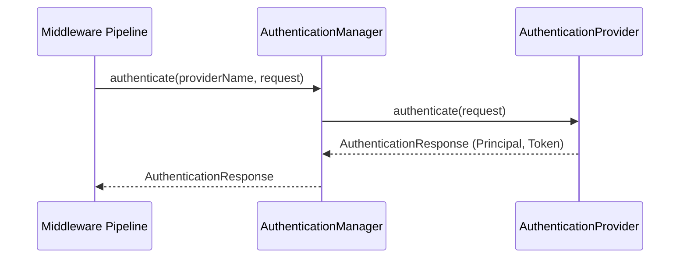

# Authentication Lifecycle

This document describes the authentication mechanisms of the security framework.

## 1. Components

- **`AuthenticationRequest`**: Structure containing user-provided credentials.
- **`AuthenticationResponse`**: Indicates outcome and includes `SecurityPrincipal` upon success.
- **`AuthenticationProvider`**: Performs actual validation. Multiple providers can be registered.
- **`AuthenticationManager`**: Registry managing active authentication providers.

## 2. Authentication Flow

## 3. Mock Authentication Provider

A `MockAuthenticationProvider` is included for development, validating:
- Username: `admin` / Password: `admin-password` (Role: `admin`, `developer`)
- Username: `user` / Password: `user-password` (Role: `developer`)
- Token: `valid-mock-token` (Role: `developer`)
