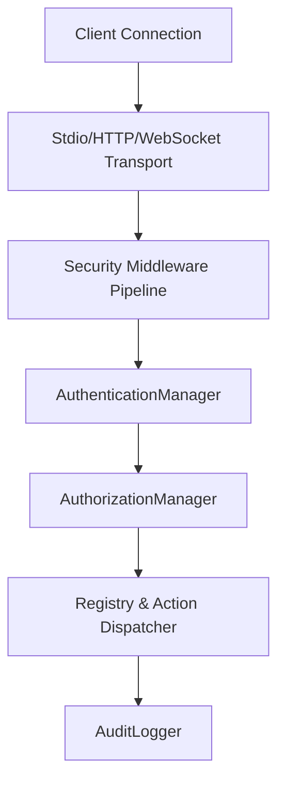

# Security Architecture Overview

This document outlines the security architecture design for the Memora MCP Server.

## 1. Design Strategy

The framework is decoupled and backend-independent, serving as a generic baseline structure for authentication, authorization, auditing, and context management.

## 2. Security Middleware Ordering

Onion-style middleware executes deterministically:
1. **Authentication Middleware**: Verifies incoming credentials and populates the `SecurityContext`.
2. **Authorization Middleware**: Asserts that the authenticated context has permissions or conforms to active policy rules.
3. **Audit Middleware**: Log records are captured for both successes and failures before returning the execution result.
