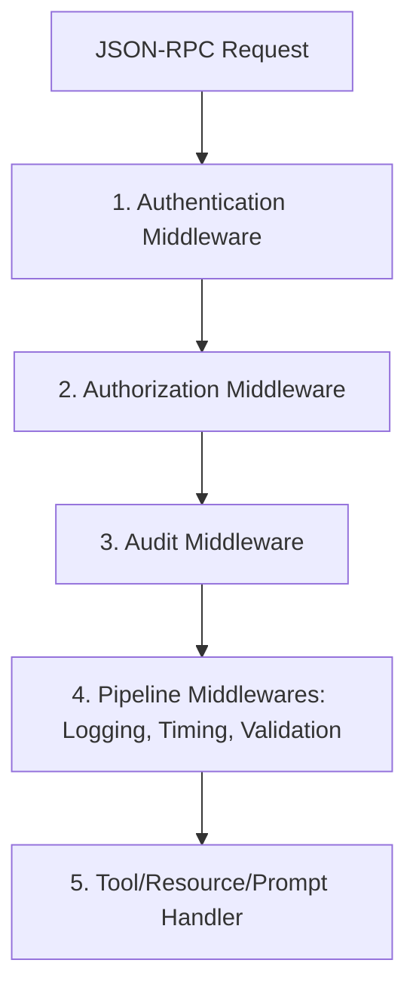

# Security Pipeline Integration

This document describes how the generic Security Framework is integrated into the Tool, Resource, and Prompt execution pipelines.

## Execution Flow

Every request dispatched to the MCP Server goes through a deterministic security middleware pipeline:

1. **Authentication Middleware**: Extracts credentials or tokens from the request parameters or metadata. Resolves the active provider (e.g., `mock`) and populates the `SecurityContext` on the execution context.
2. **Authorization Middleware**: Verifies if the request conforms to the active security policy (e.g., `allow-all`, `permission-based`, `deny-all`). In `permission-based` mode, validates the required permission against the context.
3. **Auditing Middleware**: Tracks requests and outcomes (success/failure) using the configured `AuditLogger`.
4. **Pipeline Middlewares**: Runs standard checks like validation, timing metrics, and logger formatting.
5. **Handlers**: Executes the registered business logic.

## Configuration

Security settings are configured via `ServerConfig` or environment variables:

| Environment Variable | Property in `ServerConfig` | Default Value | Description |
|---|---|---|---|
| `MEMORA_MCP_SECURITY_ENABLED` | `securityEnabled` | `true` | Enables or disables the security framework. |
| `MEMORA_MCP_DEFAULT_AUTH_PROVIDER` | `defaultAuthProvider` | `'mock'` | The default authentication provider used for verification. |
| `MEMORA_MCP_DEFAULT_AUTHZ_POLICY` | `defaultAuthzPolicy` | `'allow-all'` | The default authorization policy baseline. |
| `MEMORA_MCP_AUDIT_LOG_ENABLED` | `auditLogEnabled` | `true` | Toggles audit logging. |
