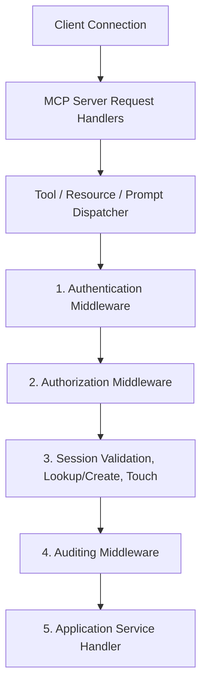

# Session Architecture and Lifecycle

This document describes the end-to-end Session & Context Management architecture implemented in the Memora MCP Server.

## 1. Design Overview

The session module integrates cleanly into the core MCP server pipelines (`ToolDispatcher`, `ResourceDispatcher`, `PromptDispatcher`), providing a decoupled, backend-independent mechanism to track client sessions, manage their metadata, touch activity time, evaluate timeouts, and propagate context to handlers.

## 2. Expiration Policies & Strategies

Session expiration is evaluated by `ExpirationEvaluator` supporting:

- **`absolute`**: Session expires after a fixed duration (`absoluteTimeoutMs`) from initial creation timestamp.
- **`sliding`**: Session expires after an idle duration (`maxIdleTimeMs`) elapses without any activity (`touchSession`).
- **`manual`**: Session expires explicitly when `isManuallyExpired` is flagged true.
- **`none`**: Session never expires automatically.

## 3. Session Cleanup

The `SessionCleanupManager` purges expired sessions from `SessionRegistry` and orphan context keys from `ContextStore`. It runs manually or periodically via `startAutoCleanup(intervalMs)`.

## 4. Session Metrics

`SessionManager` tracks runtime telemetry:
- `totalSessionsCreated`: Cumulative count of opened sessions.
- `activeSessionsCount`: Concurrent active sessions in memory.
- `expiredSessionsCount`: Total sessions expired by policies.
- `closedSessionsCount`: Total sessions explicitly closed.
- `peakActiveSessionsCount`: Highest concurrent active sessions.
- `averageSessionDurationMs`: Mean active lifetime of sessions.
- `touchCount`: Total activity touch operations performed.
- `cleanupCount`: Number of cleanup passes executed.
- `removedContextsCount`: Number of orphan context keys purged.
