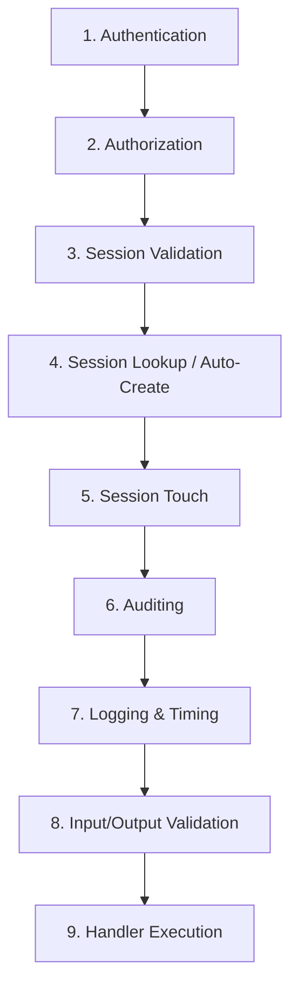

# Session Middleware Pipeline & Execution Flow

This document details the middleware pipeline execution flow for Tools, Resources, and Prompts in the Memora MCP Server.

## 1. Deterministic Execution Order

Every Tool, Resource, and Prompt request flows through an Onion-style middleware pipeline in the exact following order:

## 2. Session Middleware Hooks

- **Session Validation**: Verifies whether the incoming `context.sessionId` exists in `SessionRegistry` and is not expired (throws `SessionExpiredError`).
- **Session Lookup / Auto-Create**: Retrieves an existing session or automatically opens a new active session if none exists.
- **Session Touch**: Calls `sessionManager.touchSession(sessionId)` to refresh `lastAccessedAt` timestamp.
- **Context Attachment**: Attaches `sessionContext` to `ToolExecutionContext`, `ResourceExecutionContext`, and `PromptExecutionContext`.
