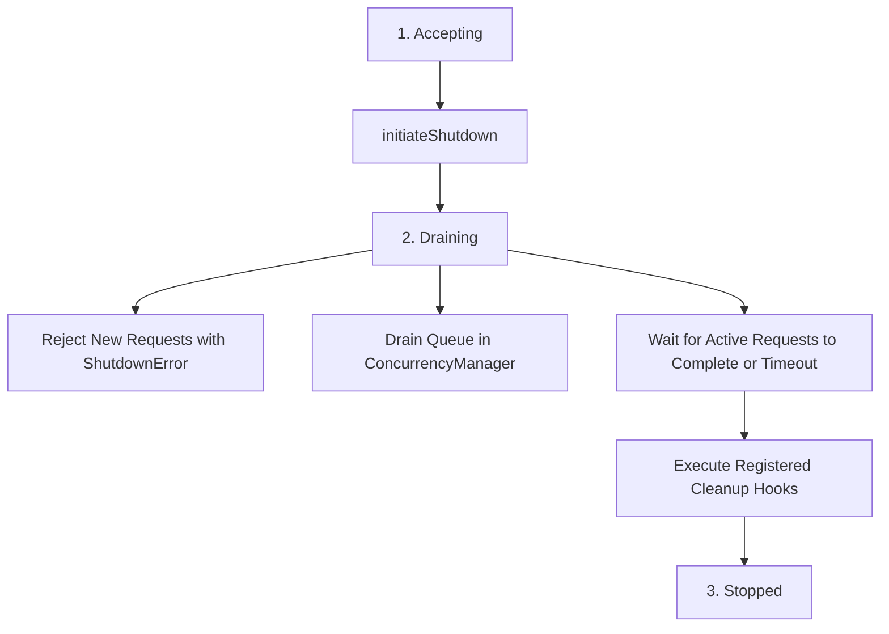

# Graceful Shutdown Architecture

This document describes the `ShutdownManager` component and shutdown lifecycle in the Memora MCP Server.

## 1. Shutdown States & Lifecycle

`ShutdownManager` coordinates graceful termination across three states:

## 2. Draining Phase

1. Transitions state to `'draining'`.
2. Emits `shutdownStarted` reliability event.
3. Rejects all currently queued tasks in `ConcurrencyManager` with `ShutdownError`.
4. Polls `activeRequestsCount` until active tasks complete or `shutdownTimeoutMs` elapses.

## 3. Cleanup Hooks & Forced Exit

1. Executes all hooks registered via `registerCleanupHook(name, hook)`.
2. Measures `cleanupDurationMs`.
3. Transitions state to `'stopped'`.
4. Emits `shutdownCompleted` reliability event.
